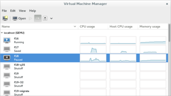
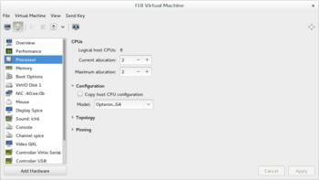
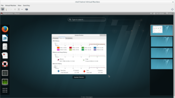

# Manage virtual machines with virt-manager

The virt-manager application is a desktop user interface for managing
virtual machines through libvirt. It primarily targets KVM VMs, but
also manages Xen and LXC (linux containers). It presents a summary
view of running domains, their live performance & resource utilization
statistics. Wizards enable the creation of new domains, and configuration
& adjustment of a domain’s resource allocation & virtual hardware. An
embedded VNC and SPICE client viewer presents a full graphical console
to the guest domain.

  
    
  
  
    
  
  
    
  

## About virt-manager’s supporting tools

* *virt-install* is a command line tool which provides an easy way to
  provision operating systems into virtual machines.

* **virt-viewer** is a lightweight UI interface for interacting with the
  graphical display of virtualized guest OS. It can display VNC or SPICE,
  and uses libvirt to lookup the graphical connection details.

* **virt-clone** is a command line tool for cloning existing inactive guests.
  It copies the disk images, and defines a config with new name, UUID and MAC
  address pointing to the copied disks.

* **virt-xml** is a command line tool for easily editing libvirt domain XML
  using virt-install’s command line options.

* **virt-bootstrap** is a command line tool providing an easy way to setup
  the root file system for libvirt-based containers.
