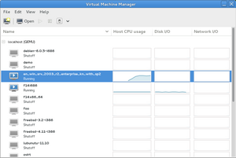
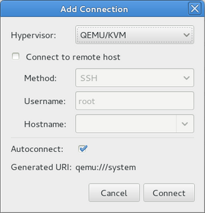
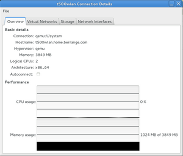
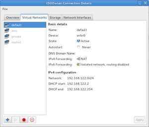
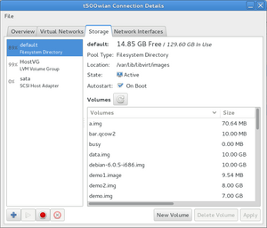
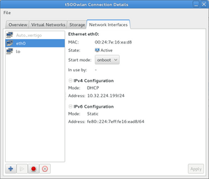
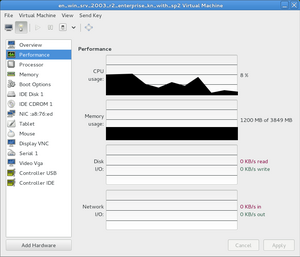
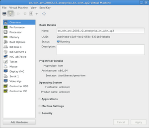
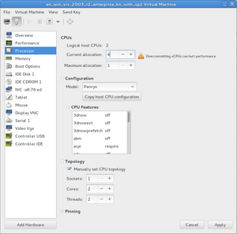
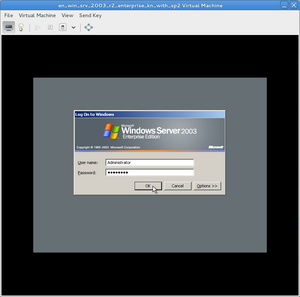

# Screenshots

## Virtual machine list

  
    
  
   
  The main window shows the list of hypervisors and the guests they host, along with performance summary for any running guests

## New connection

  
    
  
   
  Multiple hypervisor connections are permitted, to both local and remote hosts

## Host details

  
    
  
   
  The host details dialog shows a summary of host performance

## Host virtual networks

  
    
  
   
  Virtual networks are used to connect virtual machines to the physical network

## Host storage pools

  
    
  
   
  Virtual machine disks are allocated from volumes present in storage pools

## Host network interfaces

  
    
  
   
  Host network interfaces can be managed to control host connectivity

## Guest performance

  
    
  
   
  The guest dialog shows the overall virtual machine performance

## Guest summary

  
    
  
   
  The guest dialog shows the basic properties of the virtual machine

## Guest CPU

  
    
  
   
  The guest virtual machine CPU can be configured to match the host, or not as desired

## Guest console

  
    
  
   
  SPICE or VNC are used to present the graphical console of the virtual machine

